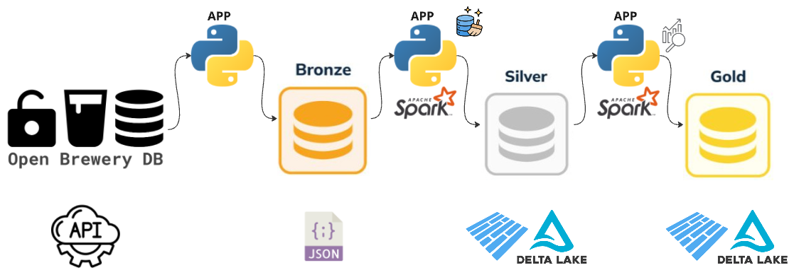

# DE_case_bs
Data Engineering Challenge

## Overview
This repository implements a data engineering pipeline for a Case challenge. The objective is to fetch brewery data from the Open Brewery DB API, transform it, and store it in a data lake using the medallion architecture (Bronze, Silver, and Gold layers). The pipeline handles data ingestion, transformation, partitioning, and aggregation.

## Key Features

### API Consumption
Fetches data from https://www.openbrewerydb.org/.
### Orchestration
[Specify tool, e.g., Apache Airflow] for scheduling, retries, and error handling.
### Data Transformation
Using Python/PySpark.
### Containerization
TO DO - Create docker structure and config map to handle with secrets and env vars  
### Medallion Architecture:
#### Bronze Layer: Raw data persisted in JSON format.
#### Silver Layer: Transformed to Parquet/Delta format. Includes data quality checks and schema enforcement.
#### Gold Layer: Aggregated tables showing brewery counts per type and location.

### Monitoring
All the logs from the application are managed by a class ready to send this logs to external tools like azure application insights. Where the application can be monitored from grafana ou azure monitor, for example.

## Setup and Installation

Clone the repository from https://github.com/thalesdamileto/DE_case_bs.git

Install dependencies: poetry install (This will use the configurations from pyproject.toml and poetry.lock)

Set up environment variables (you can use the example.env).

You will need set up java and hadoop paths on your machine path if you are using windows

## Running the Pipeline

Schedule: To manage the schedule this project, we can use the databricks workflows schedule, or trigger it through azure data factory. In a later version, when I finish the kubernetes adaptation, the schedule will be managed through cronjobs.

Error Handling: Retries on API failures, or save data errors, logging for debugging.

Run the file 'brewery_case/application/main.py' to execute the project 

## Design Choices and Trade-offs

The code was designed to a cloud environment, but for local development, a dry_run method was developed to save the data on project directory. 

The gold table agg by locations was designed with 1 column concatenetade, because its better partition tables by one column instead of 2. So i decided to give up of a greater granularity using 2 columns.

## Issues during project development
I developed the initial code on databricks (working with delta), but at some point it was getting too many errors working with delta locally. So I decided use parquet files on the dry_run to simulate the "delta lake" locally.
